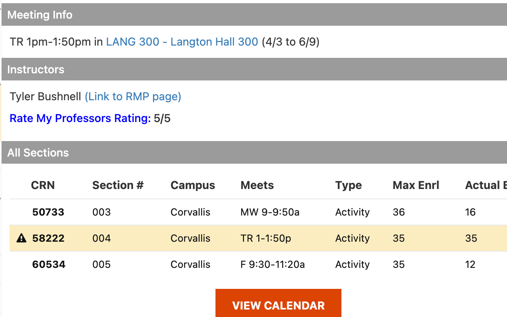

# OSU Rate My Professors Extension

## What does it do?

This extension seamlessly displays professor ratings from Rate My Professors under their names on Oregon State University's class registration page. We cut down the time you spend looking up professors by directly providing the average review rating on the class registration page and a direct link to the professor's Rate My Professors page.

### Example:

## Where can I find it?

Here is the <a href='https://chrome.google.com/webstore/detail/osu-rate-my-professor-ext/hgfogfefocfabnfjmjijfcjogeghmocn'>link</a> to the download page! Please support me by leaving a review if you found this extension helpful!
